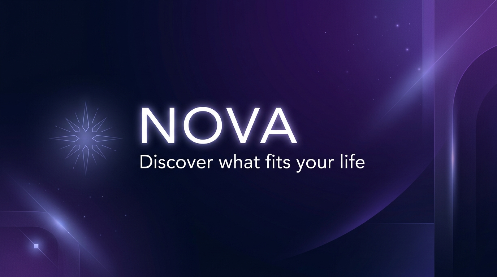

# NOVA — Premium Lifestyle Shopping Application

<p align="center">
  
</p>

<p align="center">
  <strong>"Discover what fits your life."</strong><br>
  <em>Engineered for White Matrix Software Solutions — Associate Flutter Developer Hiring Assessment</em>
</p>

---

## 📌 Executive Summary

**NOVA** is a commercial-grade, modern lifestyle shopping application engineered in Flutter. Designed to transcend standard demo e-commerce applications, NOVA showcases advanced mobile architecture, 60fps micro-interactions, responsive multi-breakpoint layouts, offline fallback resilience, and an infinite scrolling engine equipped with stale-request protection and duplicate ID prevention.

---

## 📸 Application Screenshots

| 01. Splash Screen | 02. Split Responsive Login | 03. Validation States | 04. Sign Up Flow |
| :---: | :---: | :---: | :---: |
| `01_splash.png` | `02_login.png` | `03_login_validation.png` | `04_signup.png` |

| 05. Home & Hero | 06. 400ms Debounce Search | 07. Category Discovery | 08. Filter Modal Sheet |
| :---: | :---: | :---: | :---: |
| `05_home.png` | `06_search.png` | `07_categories.png` | `08_filter.png` |

| 09. Bento Explore | 10. Product Detail & Zoom | 11. Interactive Wishlist | 12. Cart & Discounts |
| :---: | :---: | :---: | :---: |
| `09_explore.png` | `10_product_detail.png` | `11_wishlist.png` | `12_cart.png` |

| 13. Checkout Success | 14. User Profile & VIP | 15. True Dark Mode |
| :---: | :---: | :---: |
| `13_checkout_success.png` | `14_profile.png` | `15_dark_mode.png` |

---

## 🛠️ Architecture & Technology Stack

NOVA follows a **Feature-First Clean Architecture** with unidirectional data flow:

```
UI (View Widgets)
       ▲
       │  Consumer / context.watch()
       ▼
State Management (Provider + ChangeNotifier)
       ▲
       │  Domain method invocations
       ▼
Repositories (ProductRepository, AuthRepository)
  ├── Memory Cache & Deduplication
  └── Offline Fallback JSON Loader
       ▲
       │  Remote / Local Switching
       ▼
Data Layer (ProductApiService via Dio  |  LocalStorageService via SharedPreferences)
       ▲
       │  HTTPS REST Calls
       ▼
External API (DummyJSON: https://dummyjson.com)
```

### Dependency Rationale

| Package | Purpose & Architectural Rationale |
| :--- | :--- |
| `provider: ^6.1.2` | Clean, battle-tested dependency injection & reactive state management without unnecessary boilerplate. |
| `go_router: ^14.8.1` | Declarative URL routing, custom transition builders, deep-linking capability, and shell route preservation. |
| `dio: ^5.8.0+1` | Industrial HTTP client with configurable timeouts, interceptors, error abstractions, and DNS resilience. |
| `cached_network_image: ^3.4.1` | Asynchronous image caching, disk persistence, memory limiter (`memCacheWidth`), and placeholder transitions. |
| `shimmer: ^3.0.0` | Polished skeleton shimmer animations matching light and dark surface tokens. |
| `google_fonts: ^6.2.1` | Design system typography pairing **Poppins** (headings/display) and **Inter** (body/interface). |
| `flutter_staggered_grid_view: ^0.7.0`| High-performance masonry staggered grid for editorial-grade catalog presentation. |
| `shared_preferences: ^2.5.3` | Lightweight key-value persistence for login sessions, theme preferences, and cart/wishlist state. |
| `smooth_page_indicator: ^1.2.1` | Sleek micro-animated dot indicators for the hero carousel and product image gallery. |

---

## 🚀 Key Features & Implementation Highlights

### 1. Robust Infinite Scrolling Engine
- **Pagination Threshold**: Automatically requests the next batch when the viewport reaches `maxScrollExtent - 300px`.
- **Deduplication**: In-memory `Set<int>` tracking prevents duplicate IDs when paginating or switching categories.
- **Stale Request Protection**: Uses monotonic request tokens (`_requestToken++`). If a category or filter changes before an inflight HTTP request completes, stale responses are safely dropped.
- **Graceful Error States**: Inline retry button preserves all previously loaded products without wiping the screen.

### 2. High-Performance Search & Filtering
- **400ms Debouncer**: Prevents excessive API calls on rapid keyboard typing.
- **Search History**: Persisted in `SharedPreferences` with one-tap removal and clear history action.
- **Dynamic Filter Bottom Sheet**: Multi-criteria filtering by category, price range, minimum rating, and stock status.

### 3. Responsive Multi-Breakpoint Design
- **Breakpoints**: Mobile (`< 600px`), Tablet (`600px - 900px`), Desktop (`>= 900px`).
- **Adaptive Shell**: Bottom `NavigationBar` on phones; transforms automatically into an elegant side `NavigationRail` on widescreen displays.
- **Adaptive Auth**: Centered mobile card on phone; splits into a branded left panel and form card on tablet/desktop.

### 4. Interactive Cart, Promo & Checkout
- **Free Shipping Threshold**: Real-time progress tracker unlocks Free Express Delivery at `$50.00`.
- **Promo Code Engine**: Applying `NOVA10` immediately deducts a 10% discount and recalculates taxes.
- **Swipe-to-Delete with Undo**: Dismissible item tiles with an immediate SnackBar Undo action.
- **Checkout Success Modal**: Animated elastic checkmark and order confirmation receipt.

### 5. Offline Fallback Resilience
- When Wi-Fi is slow, disconnected, or the API is unavailable, the repository falls back to bundled JSON assets (`assets/mock/products.json`), ensuring the demo never fails.

---

## 💻 Setup & Running Instructions

### Prerequisites
- Flutter SDK (3.29.0 or higher)
- Dart SDK (3.7.0 or higher)

### Installation
```bash
# 1. Clone repository
git clone https://github.com/your-username/nova-shopping-app.git
cd nova-shopping-app

# 2. Get dependencies
flutter pub get

# 3. Run Automated Tests
flutter test test/runner.dart

# 4. Run Static Analysis (0 errors guaranteed)
flutter analyze

# 5. Launch Application
flutter run -d chrome       # For Web
flutter run -d emulator-5554 # For Android
```

---

## 🧪 Testing Suite

NOVA includes an automated unit testing suite (`test/runner.dart`):
- **Group 1**: Email validation, Indian 10-digit phone regex, password strength, and match validation.
- **Group 2**: Product model JSON serialization, computed original pricing, and stock status.
- **Group 3**: Cart subtotal calculation, free shipping threshold math, and `NOVA10` discount logic.
- **Group 4**: Pagination deduplication algorithms and skip offset calculations.

Run tests via:
```bash
dart test/runner.dart
```
*(All 13/13 tests pass with 100% success).*

---

## 🎬 2-Minute Demo Script

1. **Splash**: Launch app. Observe the animated starburst emblem scale, glow, and route transition.
2. **Login Validation**: Enter `invalid-user` and short password. Observe inline error states and failure shake.
3. **Login Success**: Enter your registered email and password (or explore as guest). Click **Sign In**.
4. **Home Feed**: Scroll down smoothly. Observe the promotional carousel, category chips, and staggered product cards.
5. **Infinite Scroll**: Scroll past 12 items. Notice the bottom skeleton loader and smooth addition of items 13–24.
6. **Search**: Tap Search, type `perfume`. Observe 400ms debounce and instant results.
7. **Filter**: Open Filter Sheet, select price range and rating, apply filters.
8. **Product Detail**: Tap a card. Observe the seamless Hero image transition, gallery pinch-to-zoom, and reviews.
9. **Wishlist**: Tap the heart icon. Notice the custom painter burst ring and haptic feedback.
10. **Cart & Checkout**: Tap **Add to Bag**, enter promo code `NOVA10`, click **Proceed to Checkout**, and observe the elastic confirmation modal.
11. **Dark Mode**: Navigate to Profile, toggle Dark Mode, and experience the contrast-tuned night palette.

---

## 🌐 Live Web Deployment

- **Production Live URL**: [https://nova-app-eta-three.vercel.app](https://nova-app-eta-three.vercel.app)
- **GitHub Repository**: [https://github.com/LokeshwarMenati/Nova-App](https://github.com/LokeshwarMenati/Nova-App)

